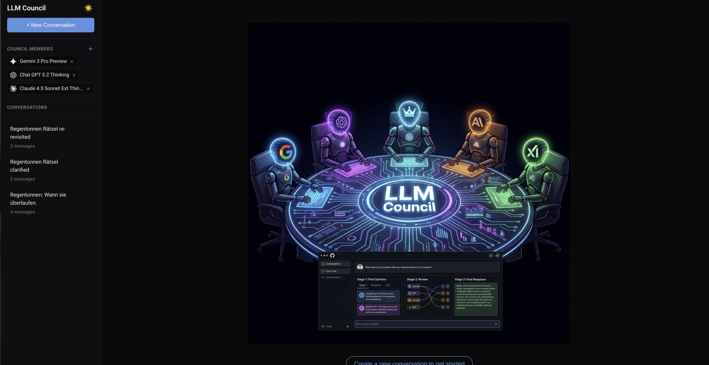

# LLM Council



LLM Council is a local web app that lets you query multiple LLMs simultaneously, have them peer-review and rank each other's responses, and then have a "Chairman" LLM synthesize a final answer. 

It supports both a fully automated mode via **OpenRouter** and a semi-automated **Web ChatBot** using browser automation to leverage free plans.

## Key Features

- **3-Stage Deliberation**: 
    1. **First Opinions**: Parallel queries to all models.
    2. **Peer Review**: Anonymized cross-evaluation where models rank each other.
    3. **Synthesis**: A Chairman LLM compiles the final result.
- **Web ChatBot with Browser Automation**: Use Free Google AI Studio and ChatGPT accounts via Playwright without needing API keys.
- **Dark Mode Support**: Sleek, modern interface with light and dark themes.
- **Flexible Council**: Add/Remove models dynamically in the UI.
- **Test Suite**: Integrated testing framework for backend and frontend.

## Setup

### 1. Install Dependencies

The project uses [uv](https://docs.astral.sh/uv/) for project management.

**Backend:**
```bash
uv sync
```

**Frontend:**
```bash
cd frontend
npm install
cd ..
```

**Browser Automation (Optional):**
To use the web-chatbot mode automation, install Playwright:
```bash
playwright install chromium
```

### 2. Configure API Key (Optional)

If using OpenRouter for fully automated council, create a `.env` file:

```bash
OPENROUTER_API_KEY=sk-or-v1-...
```

Get your API key at [openrouter.ai](https://openrouter.ai/).

### 3. Configure Models

Edit `backend/config.py` to customize your default council:

```python
COUNCIL_MODELS = [
    "openai/gpt-5-o1",
    "google/gemini-2.0-pro-exp-02-05",
    "anthropic/claude-3-7-sonnet-20250219",
]

CHAIRMAN_MODEL = "google/gemini-2.0-pro-exp-02-05"
```

## Running the Application

**Using the start script:**
```bash
./start.sh
```

Then open http://localhost:5173 in your browser.

## Web ChatBot & Browser Automation

LLM Council features a powerful **Web ChatBot** that allows you to use LLMs without API credits by automating your own browser sessions.

1. **Automation Login**: Use the "Automations" section in the sidebar to log in to **AI Studio** or **ChatGPT**. This launches a headful browser for you to sign in once; sessions are persisted locally.
2. **Model Sync**: Click the Sync icon to fetch the list of available models from your accounts.
3. **Running**: In the Chat interface, toggling **Full Web ChatBot** gives you step-by-step control. You can use the "Run via AI Studio" or "Run via ChatGPT" buttons to automate the prompt submission and response extraction.
4. **Interactive**: You can still fallback to copy-pasting if automation fails for a specific model.

## Testing

Run the full test suite (Backend Pytest + Frontend Vitest):

```bash
./run_tests.sh
```

## Tech Stack

- **Backend:** FastAPI (Python 3.10+), Playwright (for browser automation), Pytest
- **Frontend:** React + Vite, Vitest, Vanilla CSS (with Dark Mode support)
- **Storage:** JSON files in `data/conversations/`
- **Package Management:** [uv](https://docs.astral.sh/uv/) for Python, npm for JavaScript

---

*This project was inspired by Andrej Karpathy's experiments in peer-reviewing LLMs.*
